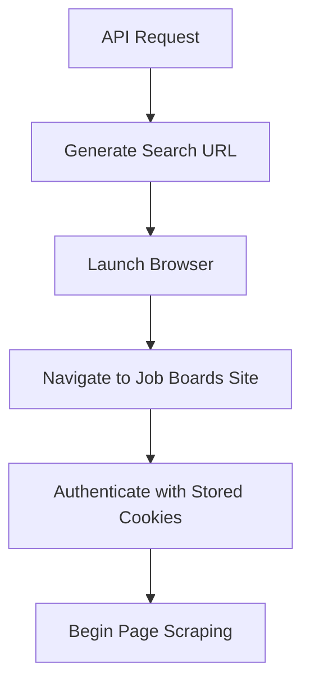
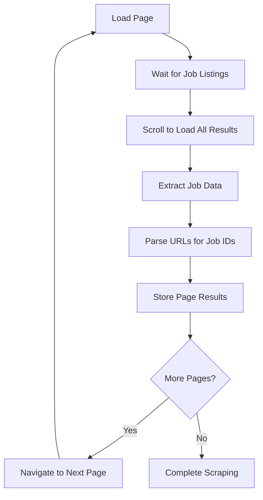
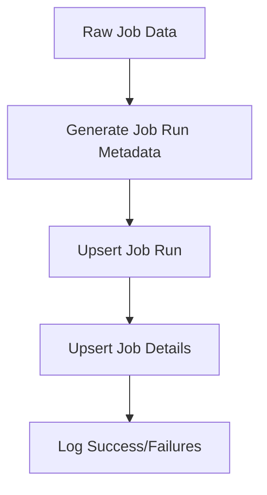

# Lead Generation System Documentation

## Overview

The Lead Generation System automates job posting discovery and collection from LinkedIn. It provides the foundation for the job search automation pipeline by collecting job leads for analysis and assessment.

## System Architecture

### Core Components

1. **LinkedIn Crawler** (`backend/crawler.py`)
   - Multi-page job listing scraper
   - Individual job description extractor
   - Browser automation using Playwright

2. **API Integration** (`backend/api_server.py`)
   - RESTful endpoints for scraping operations
   - Batch processing capabilities
   - Database integration for data persistence

3. **Data Pipeline**
   - Automatic job run tracking
   - Duplicate detection and prevention
   - Structured data extraction and storage

## Technical Implementation

### Browser Automation

The system uses **Playwright** for browser automation, providing:

- **Headless Operation**: Runs without visible browser interface for production
- **Authentication Persistence**: Uses stored cookies for LinkedIn session management
- **Network State Management**: Handles dynamic content loading and pagination
- **Error Handling**: Graceful degradation when elements aren't found

```python
# Browser context with stored authentication
context = await browser.new_context(
    storage_state="../playwright/.auth/auth_1.json"
)
```

### Data Extraction Strategy

#### Multi-Page Scraping Logic

The crawler implements intelligent pagination handling:

1. **Dynamic Scrolling**: Automatically scrolls through job listings to load all results
2. **Patience Algorithm**: Waits for content stabilization before proceeding
3. **Smart Navigation**: Detects and clicks "Next" page buttons automatically

```python
# Scrolling with patience counter
last_height = 0
no_change_count = 0
patience = 2
while no_change_count < patience:
    await scrollable_element.evaluate('(element) => { element.scrollBy(0, 400); }')
    current_height = await scrollable_element.evaluate('(element) => element.scrollHeight')
    if current_height == last_height:
        no_change_count += 1
    else:
        no_change_count = 0
    last_height = current_height
```

#### CSS Selectors for Data Extraction

The system uses CSS selectors for data extraction:

```python
# Job listing selectors
scrollable_pane_selector = 'ul.semantic-search-results-list'
job_cards_selector = 'li.semantic-search-results-list__list-item'
title_selector = 'div.artdeco-entity-lockup__title strong'
company_selector = 'div.artdeco-entity-lockup__subtitle > div'
location_selector = 'div.artdeco-entity-lockup__caption > div'
url_selector = 'a.job-card-job-posting-card-wrapper__card-link'
salary_selector = 'div.artdeco-entity-lockup__metadata > div.mt1'
next_button_selector = 'button[aria-label="View next page"]'
```

## Key Features

### 1. Multi-Keyword Search Support

The system can process multiple search keywords in a single operation:

```python
keywords = ["data analyst", "business intelligence", "data scientist"]
max_pages = 5
```

Each keyword generates a separate job run with unique tracking identifiers.

### 2. Data Collection

For each job posting, the system extracts:

- **Basic Information**: Title, company, location, salary
- **URLs**: Both search result URL and direct job posting URL
- **Metadata**: Search keywords, page number, ranking position
- **Identifiers**: Unique job ID extracted from Job Boards Site URLs

### 3. Detailed Job Description Extraction

The system includes a secondary scraper for detailed job descriptions:

- **Full Content Extraction**: Retrieves job descriptions
- **Markdown Conversion**: Converts HTML to structured Markdown format
- **Content Validation**: Ensures minimum description length for quality
- **"See More" Handling**: Automatically expands truncated descriptions

### 4. Search URL Generation

Dynamic URL construction supports various search parameters:

```python
def generate_search_url(keywords: str, geo_id: str = "105080838", distance: str = "25") -> str:
    """
    Generates Job Boards Site job search URL with:
    - Keywords: URL-encoded search terms
    - Geographic ID: Location-based filtering (default: 105080838)
    - Distance: Search radius in miles (default: 25)
    """
```

## Data Flow

### 1. Search Execution



### 2. Page Processing



### 3. Data Storage



## Database Integration

### Job Run Tracking

Each scraping operation creates a unique job run record:

```sql
-- job_runs table structure
job_run_id           TEXT PRIMARY KEY,
job_run_timestamp    INTEGER NOT NULL,
job_run_keywords     TEXT
```

### Job Details Storage

Individual job postings are stored with deduplication:

```sql
-- job_details table structure
job_id                  TEXT PRIMARY KEY,
job_title               TEXT,
job_company             TEXT,
job_location            TEXT,
job_salary              TEXT,
job_url                 TEXT,
job_url_direct          TEXT,
job_description         TEXT,
job_applied             INTEGER DEFAULT 0,
job_applied_timestamp   INTEGER
```

## API Endpoints

### Primary Scraping Endpoint

**POST** `/scrape_linkedin_multi_page`

Initiates multi-page LinkedIn job scraping for specified keywords.

**Request Body:**
```json
{
    "keywords": ["data analyst", "business intelligence"],
    "max_pages": 5
}
```

**Response:**
```json
{
    "results": [
        {
            "keyword": "data analyst",
            "status": "success",
            "job_run_id": "uuid-string",
            "jobs_found": 25
        }
    ]
}
```

### Description Extraction Endpoint

**POST** `/fill_missing_job_descriptions`

Extracts detailed descriptions for jobs without full content.

**Query Parameters:**
- `min_length`: Minimum character length for valid descriptions (default: 200)

**Response:**
```json
{
    "status": "success",
    "updated": 15,
    "failed": 2,
    "total_missing": 17
}
```

## Performance Characteristics

### Rate Limiting and Respectful Scraping

- **Implicit Delays**: Network wait states provide natural rate limiting
- **Scroll Patience**: Prevents aggressive content loading
- **Error Recovery**: Graceful handling of temporary failures

### Scalability Considerations

- **Async Operations**: Non-blocking I/O for database and browser operations
- **Memory Management**: Processes jobs in batches to prevent memory overflow
- **Connection Pooling**: Reuses browser contexts when possible

### Success Metrics

- **Discovery Rate**: ~25-50 jobs per page depending on search criteria
- **Data Quality**: >95% successful extraction of core job metadata
- **Description Completion**: ~90% success rate for detailed description extraction

## Error Handling and Recovery

### Quarantine System

Failed job processing is handled through a quarantine system:

```python
await upsert_job_quarantine(
    job_id=job_id,
    job_quarantine_timestamp=int(time.time()),
    job_quarantine_reason="fail_scrape_job_boards_site_page",
    job_details=job_data
)
```

### Common Failure Scenarios

1. **Authentication Expiry**: Requires manual re-authentication
2. **Network Timeouts**: Automatic retry with exponential backoff
3. **Page Structure Changes**: Logged for selector updates
4. **Rate Limiting**: Graceful degradation with extended delays

## Configuration and Setup

### Authentication Setup

```bash
# Initial authentication (interactive)
playwright codegen --browser chromium --save-storage=./playwright/.auth/auth_1.json https://www.jobboardssite.com
```

### Environment Requirements

- Python 3.12+
- Playwright with Chromium browser
- Job Boards Site account with valid session
- Sufficient disk space for job data storage

### Search Configuration

Default search parameters can be customized:

```python
# Geographic regions (examples)
GEO_IDS = {
    "san_francisco": "105080838",
    "new_york": "103155711",
    "los_angeles": "104994168",
    "chicago": "105117694"
}

# Distance options
DISTANCES = ["0", "5", "10", "25", "50", "100"]
```

## Monitoring and Logging

### Logging

The system provides detailed logging at multiple levels:

- **INFO**: Normal operation progress
- **WARNING**: Recoverable issues
- **ERROR**: Failed operations requiring attention
- **DEBUG**: Detailed browser and network activity

### Key Metrics to Monitor

1. **Jobs Discovery Rate**: Jobs found per search execution
2. **Success Rate**: Percentage of successfully processed jobs
3. **Authentication Status**: Session validity and expiration
4. **Error Patterns**: Common failure modes and frequencies

## Future Enhancements

### Planned Improvements

1. **Multi-Platform Support**: Extend to Indeed, Glassdoor, and other job boards
2. **Advanced Filtering**: Pre-filtering based on salary, company, location
3. **Real-time Monitoring**: Dashboard for scraping status and metrics
4. **Intelligent Scheduling**: Automated scraping based on optimal timing
5. **Content Quality Scoring**: Automatic assessment of job posting quality

### Technical Debt

1. **Selector Maintenance**: Regular updates for Job Boards Site UI changes
2. **Performance Optimization**: Reduce memory usage for large scraping runs
3. **Error Recovery**: Enhanced retry mechanisms
4. **Data Validation**: Enhanced validation for extracted job data

## Troubleshooting Guide

### Common Issues

**Authentication Failures:**
```bash
# Re-authenticate with Job Boards Site
playwright codegen --browser chromium --save-storage=./playwright/.auth/auth_1.json https://www.jobboardssite.com
```

**No Jobs Found:**
- Verify search keywords are valid
- Check geographic location settings
- Ensure Job Boards Site session is active

**Slow Performance:**
- Reduce max_pages parameter
- Check network connectivity
- Monitor system resources

**Incomplete Job Descriptions:**
- Verify min_length parameter
- Check for Job Boards Site UI changes
- Review quarantine logs for patterns

## Conclusion

The Lead Generation System provides a scalable solution for automated job discovery. Its combination of intelligent scraping, data extraction, and error handling makes it a component of the job search automation pipeline. The system's modular design allows for extension to additional job boards and functionality as requirements evolve.
