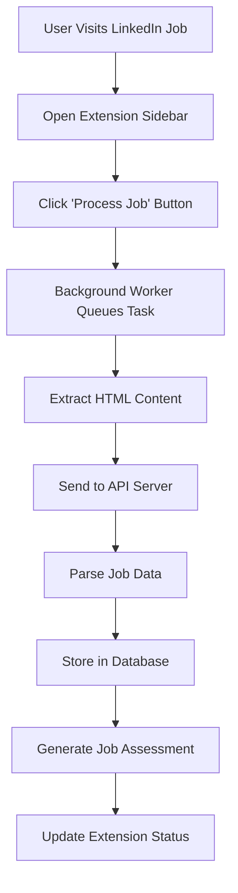
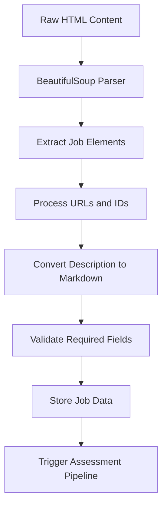
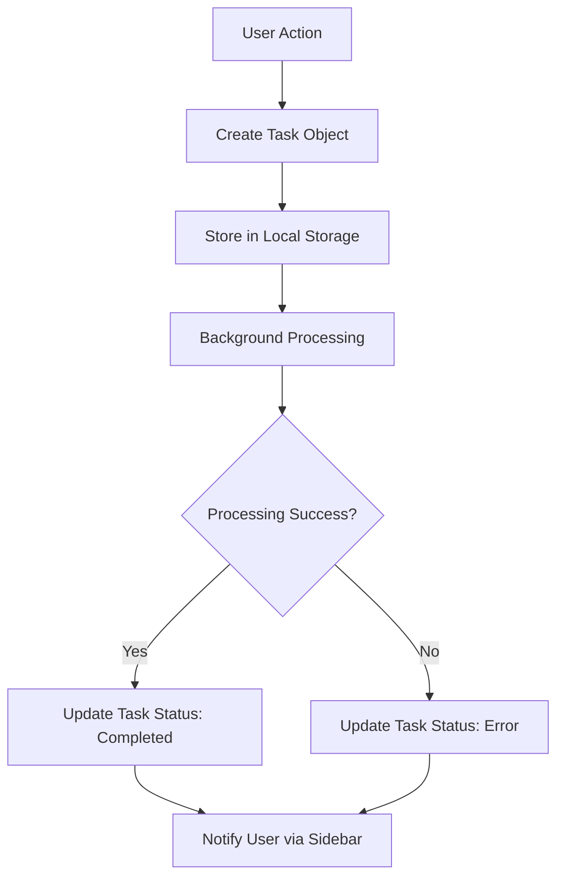

# Lead Generation System Documentation

## Overview

The Lead Generation System provides manual job posting extraction and collection from LinkedIn through a Firefox browser extension. It provides the foundation for the job search automation pipeline by collecting job leads for analysis and assessment through user-initiated extraction rather than automated scraping.

## System Architecture

### Core Components

1. **Firefox Browser Extension** (`frontend/companion-firefox/`)
   - User-initiated job extraction
   - Background processing with task queuing
   - Local storage for task management
   - Sidebar interface for user interaction

2. **HTML Content Extractor** (`backend/crawler.py`)
   - Manual HTML parsing and data extraction
   - LinkedIn job posting structure parsing
   - Markdown conversion for job descriptions
   - Job ID extraction from URLs

3. **API Integration** (`backend/api_server.py`)
   - RESTful endpoints for HTML extraction and processing
   - Job assessment pipeline integration
   - Database integration for data persistence
   - OpenRouter API credit monitoring

4. **Data Pipeline**
   - Manual job extraction workflow
   - Structured data extraction and storage
   - Automatic job assessment generation

## Technical Implementation

### Firefox Extension Architecture

The system uses a **Firefox Web Extension** (Manifest V3) for user-controlled data extraction:

- **Background Worker**: Handles long-running API calls without blocking the UI
- **Content Scripts**: Extracts HTML content from LinkedIn job pages
- **Sidebar Interface**: Provides user controls and status updates
- **Local Storage**: Manages task queuing and completion tracking
- **Dashboard Integration**: Multi-page interface for job management

```javascript
// Extension manifest configuration
{
  "manifest_version": 3,
  "name": "Job Search Copilot",
  "permissions": ["activeTab", "scripting", "storage"],
  "sidebar_action": {
    "default_panel": "sidebar/sidebar.html"
  }
}
```

### HTML Content Extraction Strategy

#### Manual Extraction Workflow

The extractor implements intelligent HTML parsing for LinkedIn job pages:

1. **Element Detection**: Searches for multiple possible job detail container selectors
2. **Content Extraction**: Extracts structured data from HTML elements using BeautifulSoup
3. **URL Processing**: Extracts job IDs from both direct URLs and search result URLs
4. **Markdown Conversion**: Converts HTML job descriptions to clean Markdown format

```python
# Content extraction with multiple selector fallbacks
target_selectors = [
    'div.jobs-search__job-details--wrapper',
    'div.jobs-semantic-search-job-details-wrapper', 
    'div.job-view-layout'
]
```

## Key Features

### 1. User-Controlled Job Extraction

The system processes individual job postings through user interaction:

```javascript
// User-initiated extraction from sidebar
document.getElementById('extract-btn').addEventListener('click', async () => {
    const [activeTab] = await browser.tabs.query({active: true, currentWindow: true});
    const task = {
        id: generateTaskId(),
        url: activeTab.url,
        status: 'queued',
        createdAt: new Date().toISOString()
    };
    
    // Send to background worker for processing
    browser.runtime.sendMessage({action: 'processJob', task: task});
});
```

### 2. Comprehensive Data Collection

For each job posting, the system extracts:

- **Basic Information**: Title, company, location, salary
- **URLs**: Both search result URL and direct job posting URL  
- **Content**: Full job description converted to Markdown
- **Identifiers**: Unique job ID extracted from LinkedIn URLs
- **Metadata**: Processing timestamps and status tracking

### 3. Automatic Job Assessment Integration

The system seamlessly triggers the AI assessment pipeline:

- **Assessment Generation**: Automatically runs job qualification analysis
- **Skills Matching**: Compares requirements against candidate profile
- **Database Storage**: Persists all extracted data and assessments
- **Error Handling**: Quarantines failed extractions for review

### 4. Extension Dashboard Interface

Multi-page dashboard for comprehensive job management:

- **Dashboard**: Overview of recent jobs and processing status
- **History**: Complete extraction and assessment history
- **Session**: Current browser session job tracking
- **Resume**: Master resume management and viewing

## Data Flow

### 1. Manual Job Extraction Workflow



### 2. Content Processing Pipeline



### 3. Extension Task Management



## Database Integration

### Job Data Storage

Individual job postings are stored with comprehensive metadata:

```sql
-- job_details table structure
job_id                  TEXT PRIMARY KEY,
job_title               TEXT,
job_company             TEXT,
job_location            TEXT,
job_salary              TEXT,
job_url                 TEXT,
job_url_direct          TEXT,
job_description         TEXT,
job_applied             INTEGER DEFAULT 0,
job_applied_timestamp   INTEGER
```

### Document Management

The system stores various document types for processing:

```sql
-- document_store table structure  
document_id             TEXT PRIMARY KEY,
document_name           TEXT,
document_timestamp      INTEGER,
document_markdown       TEXT,
document_job_id_reference TEXT,
document_job_type       TEXT
```

### Assessment Integration

Job assessments are linked through the job_skills table:

```sql
-- job_skills table structure
job_skill_id            TEXT PRIMARY KEY,
job_id                  TEXT,
job_skills_atomic_string TEXT,
job_skills_type         TEXT,
job_skills_match_reasoning TEXT,
job_skills_match        INTEGER,
job_skills_resume_id    TEXT
```

## API Endpoints

### Primary HTML Extraction Endpoint

**POST** `/html_extract`

Processes HTML content from LinkedIn job pages and extracts structured job data.

**Request Body:**
```json
{
    "html": "<html>...</html>",
    "url": "https://www.linkedin.com/jobs/view/12345678"
}
```

**Response:**
```json
{
    "status": "success",
    "data": {
        "job_id": "12345678",
        "job_title": "Senior Data Analyst",
        "job_company": "Tech Corp",
        "job_location": "San Francisco, CA (Remote)",
        "job_salary": "$120,000 - $150,000/year",
        "job_description": "## About the Role\n\nWe are seeking...",
        "job_url": "https://www.linkedin.com/jobs/search/?currentJobId=12345678",
        "job_url_direct": "https://www.linkedin.com/jobs/view/12345678",
        "required_qualifications": [...],
        "additional_qualifications": [...],
        "evaluated_qualifications": [...]
    }
}
```

### Job Assessment Regeneration

**POST** `/regenerate_job_assessment`

Regenerates AI assessment for a specific job, useful for reprocessing with updated prompts.

**Request Body:**
```json
{
    "job_id": "12345678"
}
```

**Response:**
```json
{
    "status": "success", 
    "data": {
        "job_id": "12345678",
        "required_qualifications": [...],
        "additional_qualifications": [...],
        "evaluated_qualifications": [...]
    }
}
```

### Job Application Status Management

**POST** `/update_job_applied`

Marks a job as applied with timestamp.

**POST** `/update_job_unapplied`  

Reverts job application status.

**Request Body:**
```json
{
    "job_id": "12345678"
}
```

### Data Retrieval Endpoints

**GET** `/job_details` - Retrieve all job details
**GET** `/jobs_recent?days_back=5&limit=300` - Recent assessed jobs
**GET** `/job_skills_recent?days_back=5&limit=300` - Recent job skills analysis
**GET** `/master_resume` - Master resume document
**GET** `/openrouter_credits` - API credit balance

## Performance Characteristics

### User-Controlled Processing

- **Manual Trigger**: Processing only occurs when user initiates extraction
- **Background Processing**: API calls happen asynchronously without blocking UI
- **Local Task Management**: Extension handles task queuing and status tracking
- **Graceful Error Recovery**: Failed extractions are logged and can be retried

### Extraction Success Metrics

- **HTML Processing**: >95% success rate for LinkedIn job page structure recognition
- **Data Completeness**: ~90% success rate for extracting all required job fields
- **Assessment Pipeline**: Automatic triggering of AI analysis for successful extractions
- **URL Processing**: 100% success rate for job ID extraction from valid LinkedIn URLs

### Extension Performance

- **Response Time**: <500ms for local task creation and queuing
- **API Processing**: 2-5 seconds for complete job extraction and assessment
- **Memory Usage**: Minimal impact on browser performance
- **Storage Efficiency**: Local storage used only for active task management

## Error Handling and Recovery

### Extension Error Management

Task failures are handled gracefully with comprehensive logging:

```javascript
// Error handling in background worker
catch (error) {
    console.error(`Failed to process task ${task.id}:`, error);
    task.status = 'error';
    task.error = error.message;
    await browser.storage.local.set({ [task.id]: task });
}
```

### API Error Responses

The system provides detailed error information for troubleshooting:

```json
{
    "status": "error",
    "message": "Could not parse job ID from URL: https://example.com"
}
```

### Database Quarantine System

Failed job processing is handled through a quarantine system for analysis:

```python
await upsert_job_quarantine(
    job_quarantine_id=str(uuid.uuid4()),
    job_id=job_id,
    job_quarantine_reason="failed_html_extraction",
    job_quarantine_timestamp=int(time.time())
)
```

### Common Failure Scenarios

1. **Unrecognized Page Structure**: LinkedIn layout changes requiring selector updates
2. **Network Timeouts**: API server unavailable or slow response times  
3. **Invalid URLs**: Non-LinkedIn URLs or malformed job page URLs
4. **Missing Content**: Job pages without sufficient extractable data
5. **Extension Permissions**: Browser security restrictions on content access

## Configuration and Setup

### Firefox Extension Installation

1. **Load Extension**: Load unpacked extension from `frontend/companion-firefox/` directory
2. **Permissions**: Grant necessary permissions for content access and storage
3. **API Configuration**: Ensure backend API server is running on `http://127.0.0.1:8000`

### Extension Configuration

Extension settings are configured in `manifest.json`:

```json
{
    "permissions": ["activeTab", "scripting", "storage"],
    "host_permissions": ["http://*/*", "https://*/*"],
    "content_security_policy": {
        "extension_pages": "script-src 'self'; connect-src http://localhost:* http://127.0.0.1:*;"
    }
}
```

### API Server Requirements

- **FastAPI Backend**: Running on port 8000
- **Database**: SQLite database with required schema
- **OpenRouter API**: Valid API key for job assessments
- **Document Storage**: Master resume document configured

### Usage Workflow

1. **Navigate**: Visit a LinkedIn job posting page
2. **Open Sidebar**: Click extension icon to open sidebar panel
3. **Process Job**: Click "Process Job" button to extract data
4. **Monitor Status**: Watch progress in sidebar status display  
5. **View Results**: Access processed jobs via dashboard pages

## Monitoring and Logging

### Extension Logging

The extension provides browser console logging for debugging:

```javascript
// Task processing logs
console.log('Processing task:', task.id);
console.error('Failed to process task:', error);

// API communication logs  
console.log('API response received:', response.status);
```

### API Server Logging

The backend provides structured logging at multiple levels:

- **INFO**: Normal extraction operations and API requests
- **WARNING**: Recoverable parsing issues or data quality problems
- **ERROR**: Failed extractions requiring attention
- **DEBUG**: Detailed HTML parsing and database operations

### Key Metrics to Monitor

1. **Extraction Success Rate**: Percentage of successful job data extractions
2. **Assessment Pipeline**: Success rate of automatic job qualification analysis
3. **API Response Times**: Performance of HTML extraction endpoints
4. **Extension Task Completion**: User-initiated extraction completion rates
5. **Database Growth**: Number of jobs and assessments stored over time
6. **OpenRouter Credits**: API usage and remaining credit balance
2. **Success Rate**: Percentage of successfully processed jobs
3. **Authentication Status**: Session validity and expiration
4. **Error Patterns**: Common failure modes and frequencies

## Future Enhancements

### Planned Improvements

1. **Multi-Platform Support**: Extend to Indeed, Glassdoor, and other job boards
2. **Advanced Filtering**: Pre-filtering based on salary, company, location
3. **Real-time Monitoring**: Dashboard for scraping status and metrics
4. **Intelligent Scheduling**: Automated scraping based on optimal timing
5. **Content Quality Scoring**: Automatic assessment of job posting quality

### Technical Debt

1. **Selector Maintenance**: Regular updates for Job Boards Site UI changes
2. **Performance Optimization**: Reduce memory usage for large scraping runs
3. **Error Recovery**: Enhanced retry mechanisms
4. **Data Validation**: Enhanced validation for extracted job data

## Troubleshooting Guide

### Common Issues

**Authentication Failures:**
```bash
# Re-authenticate with Job Boards Site
playwright codegen --browser chromium --save-storage=./playwright/.auth/auth_1.json https://www.jobboardssite.com
```

**No Jobs Found:**
- Verify search keywords are valid
- Check geographic location settings
- Ensure Job Boards Site session is active

**Slow Performance:**
- Reduce max_pages parameter
- Check network connectivity
- Monitor system resources

**Incomplete Job Descriptions:**
- Verify min_length parameter
- Check for Job Boards Site UI changes
- Review quarantine logs for patterns

## Conclusion

The Lead Generation System provides a scalable solution for automated job discovery. Its combination of intelligent scraping, data extraction, and error handling makes it a component of the job search automation pipeline. The system's modular design allows for extension to additional job boards and functionality as requirements evolve.
