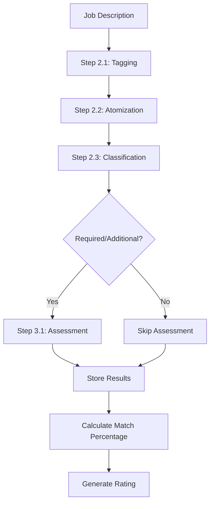
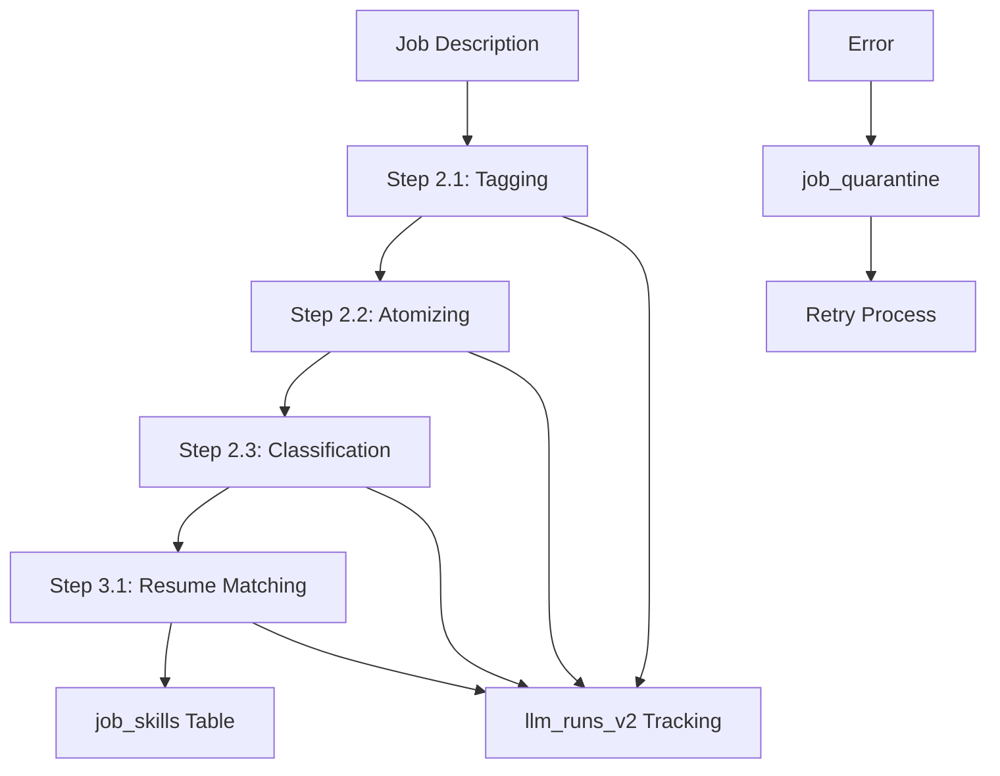

# Lead Qualification System Documentation

## Overview

The Lead Qualification System evaluates job postings against a candidate's resume to determine match quality and qualification levels. Built on OpenRouter's AI models (primarily using reasoning-capable models), the system provides structured analysis of job requirements versus candidate qualifications, enabling data-driven job application prioritization through a multi-step pipeline approach.

## System Architecture

### Core Components

## System Architecture

### Core Components

1. **OpenRouter AI Integration** (`backend/llm.py`)
   - Multi-model AI assessment pipeline
   - Structured response generation using Pydantic schemas
   - Reasoning-capable model support with token budgets
   - Concurrent processing with semaphore control

2. **Assessment Pipeline Engine**
   - 4-step job requirement decomposition
   - Individual requirement matching against resume
   - Atomic skill analysis and categorization
   - Match reasoning and scoring with detailed explanations

3. **Prompt Management System** (`backend/llm_prompts/`)
   - Database-driven prompt versioning
   - Template-based prompt configurations
   - Model-specific parameter management
   - Response schema definitions

4. **Data Persistence & Tracking**
   - Comprehensive assessment result storage
   - LLM run tracking with token usage monitoring
   - Job quarantine system for error handling
   - Audit trails for all AI interactions

## Assessment Pipeline

The system employs a 4-step pipeline for job assessment using Pydantic models for structured responses:

### Phase 1: Job Description Deconstruction

#### Step 2.1: Initial Tagging (`ja_2_1_assessment`)
Extracts and categorizes job requirements from raw job descriptions:

```python
class TaggedList(BaseModel):
    raw_string: str = Field(..., description="Extracted qualification/skill from the job description")
    category: CategoryEnum = Field(..., description="The category of the raw string, can either be 'required' or 'additional'")

class ResponseData_2_1(BaseModel):
    tagged_list: List[TaggedList] = Field(..., description="A list of tagged qualifications/skills extracted from the job description.")
```

**Output Example:**
```json
{
  "tagged_list": [
    {
      "raw_string": "Bachelor's degree in Computer Science or related field",
      "category": "required"
    },
    {
      "raw_string": "Experience with cloud platforms like AWS or Azure",
      "category": "additional"
    }
  ]
}
```

#### Step 2.2: Atomic Decomposition (`ja_2_2_assessment`)
Breaks down tagged requirements into atomic, individually assessable components:

```python
class AtomicObject(BaseModel):
    requirement_string: str = Field(..., description="The atomic string result from breaking down of qualifications/skills into atomic components")
    category: CategoryEnum = Field(..., description="The category of the atomic string, can either be 'required' or 'additional'")

class ResponseData_2_2(BaseModel):
    atomic_objects: List[AtomicObject] = Field(..., description="A list of atomic objects.")
```

**Input:** Tagged list from Step 2.1
**Output Example:**
```json
{
  "atomic_objects": [
    {
      "requirement_string": "Bachelor's degree",
      "category": "required"
    },
    {
      "requirement_string": "Computer Science field",
      "category": "required"
    },
    {
      "requirement_string": "AWS experience",
      "category": "additional"
    },
    {
      "requirement_string": "Azure experience", 
      "category": "additional"
    }
  ]
}
```

#### Step 2.3: Final Classification (`ja_2_3_assessment`)
Applies final categorization to each atomic requirement:

```python
class ClassifiedObject(BaseModel):
    requirement_string: str = Field(..., description="The provided requirement string")
    classification: ClassificationEnum = Field(..., description="The classification of the atomic string, can either be 'required_qualification', 'additional_qualification', or 'evaluated_qualification'")

class ResponseData_2_3(BaseModel):
    classified_objects: List[ClassifiedObject] = Field(..., description="A list of classified objects.")
```

### Phase 2: Resume Matching

#### Step 3.1: Individual Assessment (`ja_3_1_assessment`)
Each qualified atomic requirement is individually assessed against the candidate's resume:

```python
class AssessedObject(BaseModel):
    requirement_string: str = Field(..., description="The atomic string requirement to be assessed against the candidate profile")
    match_reasoning: str = Field(..., description="The reasoning behind the match decision")
    match: bool = Field(..., description="Boolean indicating if the requirement matches the candidate profile")

class ResponseData_3_1(BaseModel):
    assessed_objects: List[AssessedObject] = Field(..., description="A list of assessed objects with match reasoning and boolean match.")
```

**Process:**
1. Template renders requirement against candidate profile
2. AI provides detailed reasoning for match/no-match decision
3. Boolean match result determined
4. Retry logic ensures valid responses

**Output Example:**
```json
{
  "assessed_objects": [
    {
      "requirement_string": "Bachelor's degree",
      "match_reasoning": "The candidate has a Master's degree in Data Science, which exceeds the Bachelor's requirement.",
      "match": true
    },
    {
      "requirement_string": "AWS experience",
      "match_reasoning": "The candidate's resume does not explicitly mention AWS experience or cloud platform work.",
      "match": false
    }
  ]
}
```

**Output Example:**
```json
## Assessment Criteria

### Match Determination Standards

The system uses conservative matching logic requiring explicit evidence from the resume:

#### ✓ Match Criteria
1. **Years of Experience**: Candidate's domain experience meets or exceeds requirement
2. **Specific Skills/Tools**: Exact tool or direct equivalent found in resume
3. **Conceptual Skills**: Methodology or concept explicitly mentioned
4. **Education Level**: Degree level meets minimum requirements
5. **"Similar" Clauses**: Any relevant tool from category matches broad requirements

#### ✗ No Match Criteria
1. **Missing Keywords**: Required skill/tool not found in resume
2. **Insufficient Experience**: Years of experience below threshold
3. **Degree Field Mismatch**: Education in unrelated field
4. **Partial Compound Requirements**: Missing any component of multi-part requirement

### Rating System [To Be Confirmed]

The system generates three-tier ratings based on required qualification matches:

```python
# Rating calculation logic
match_percentage = required_qualifications_matched_count / total_required_qualifications

if match_percentage > 0.8:
    rating = "high"
elif match_percentage >= 0.5:
    rating = "medium"
else:
    rating = "low"
```

#### Rating Descriptions
- **High (>80%)**: "Your profile seems to match well with this job. You may be ready to apply."
- **Medium (50-80%)**: "Your profile matches several required qualifications. Consider updating your profile or exploring better matches."
- **Low (<50%)**: "Your profile is missing some required qualifications. Look for jobs with stronger matches."
```
                    "2B_category": Schema(
                        type=Type.STRING,
                        enum=["required", "additional"]
                    )
                }
            )
        )
    }
)
```

**Purpose**: Extracts and initially categorizes requirements from job descriptions into "required" or "additional" qualifications.

#### Step 2: Requirement Atomization (`ja_2_2_jobdesc_atomizing`)
```python
# Break down compound requirements into atomic units
response_schema_2_2 = Schema(
## Technical Implementation

### OpenRouter API Integration

The system uses **OpenRouter** as the AI provider with reasoning-capable models:

```python
# API configuration and request
url = "https://openrouter.ai/api/v1/chat/completions"
headers = {
    "Authorization": f"Bearer {os.getenv('OPENROUTER_API_KEY')}",
    "Content-Type": "application/json"
}

payload = {
    "model": model,
    "messages": messages,
    "reasoning": {"effort": "low"},
    "response_format": {
        "type": "json_schema",
        "json_schema": response_schema.model_json_schema(),
    },
    "provider": {
        "order": ["deepinfra/fp4","nebius/fp4","fireworks"],
        "allow_fallbacks": False,
        "require_parameters": True
    },
    "temperature": temperature
}
```

### Structured Response Generation

Uses Pydantic models for consistent, validated responses:

```python
# Response validation and parsing
message_content = response['choices'][0]['message']['content']
parsed_data = json.loads(message_content)

# Extract token usage for cost tracking
usage = response['usage']
input_tokens = usage['prompt_tokens']
output_tokens = usage['completion_tokens'] 
reasoning_tokens = usage.get('completion_tokens_details', {}).get('reasoning_tokens', 0) or 0
```
### Data Flow Architecture



### Concurrent Processing Architecture

The system uses semaphore-controlled concurrency for scalable processing:

```python
async def process_single_job_assessment(
    job: dict, 
    resume: dict,
    resume_json: dict,
    prompt_configuration_2_1: dict,
    prompt_configuration_2_2: dict, 
    prompt_configuration_2_3: dict,
    prompt_configuration_3_1: dict,
    semaphore: asyncio.Semaphore
) -> bool:
    async with semaphore:
        # Assessment processing logic
        pass

# Create semaphore for controlling concurrency
semaphore = asyncio.Semaphore(1)  # Process jobs one at a time per default
```

### Database-Driven Prompt Management

The system uses database-stored prompts with versioning:

```python
# Fetch latest prompt configuration
prompt_configuration = await get_latest_prompt("ja_2_1_assessment")
if prompt_configuration is None:
    raise ValueError("No prompt configuration found for ja_2_1_assessment")

# Template rendering with context
content_template = Template(prompt_configuration['prompt_template'])
content = content_template.render(job_description=job['job_description'])
```

### LLM Run Tracking and Monitoring

Comprehensive tracking of all AI API interactions:

```python
# Track each LLM run with detailed metrics
await upsert_llm_run_v2(
    llm_run_id=llm_run_id,
    job_id=job_id,
    llm_run_type=llm_run_type,
    llm_run_model_id=model,
    llm_run_system_prompt_id=llm_run_system_prompt_id,
    llm_run_input=content,
    llm_run_output=llm_run_output,
    llm_run_input_tokens=input_tokens,
    llm_run_output_tokens=output_tokens,
    llm_run_thinking_tokens=reasoning_tokens,
    llm_run_total_tokens=total_tokens,
    llm_run_start=time_start,
    llm_run_end=time_end
)
```

## Technical Implementation

### Data Flow Architecture



### Concurrent Processing Architecture

The system uses semaphore-controlled concurrency for scalable processing:

```python
async def generate_job_assessment(limit: int = 100, days_back: int = 14, semaphore_count: int = 5):
    # Create semaphore for controlling concurrency
    semaphore = asyncio.Semaphore(semaphore_count)
    
    # Create tasks for concurrent processing
    tasks = [
        process_single_job_assessment(
            job=job,
            resume=resume,
            prompt_configuration_2_1=prompt_configuration_2_1,
            prompt_configuration_2_2=prompt_configuration_2_2,
            prompt_configuration_2_3=prompt_configuration_2_3,
            prompt_configuration_3_1=prompt_configuration_3_1,
            semaphore=semaphore
        )
        for job in job_details
    ]
    
    # Execute all tasks concurrently with semaphore control
    results = await asyncio.gather(*tasks, return_exceptions=True)
```

### Prompt Management System

The system uses a prompt management approach:

```python
# Version-controlled prompts with model configuration
prompt_configuration = await get_latest_prompt("ja_2_1_jobdesc_tagging")
# Contains: prompt_system_prompt, prompt_template, model_id, temperature, etc.

# Template rendering with context
content_template = Template(prompt_configuration['prompt_template'])
content = content_template.render(job_description=job['job_description'])
```

### Token Usage Monitoring

Tracking of AI API consumption for cost optimization:

```python
token_details_by_model = {}
# Track token usage for each model and operation type
model_name = result['tokens']['model']
if model_name not in token_details_by_model:
    token_details_by_model[model_name] = {'input': 0, 'output': 0, 'thinking': 0}
token_details_by_model[model_name]['input'] += result['tokens']['input_tokens']
token_details_by_model[model_name]['output'] += result['tokens']['output_tokens']
token_details_by_model[model_name]['thinking'] += result['tokens']['thinking_tokens']
```

### Error Handling and Quarantine System

Error recovery with categorized failure tracking:

```python
# Quarantine failed jobs with specific error codes
await upsert_job_quarantine(
    job_quarantine_id=str(uuid.uuid4()),
    job_id=job_id,
    job_quarantine_reason="failed_generate_assessment",
    job_quarantine_timestamp=int(time.time())
)
```

**Quarantine Reasons:**
- `failed_generate_assessment`: Error in assessment generation pipeline
- `missing_job_description`: Job lacks required content for assessment
- `missing_resume`: Master resume document unavailable
- `prompt_configuration_error`: Required prompt templates not found

**Error Recovery Process:**
1. **Automatic Retry**: Failed assessments can be regenerated via `/regenerate_job_assessment`
2. **Quarantine Analysis**: Failed jobs stored for debugging and pattern analysis
3. **Prompt Updates**: New prompt versions can be deployed to fix systematic issues
4. **Manual Intervention**: Complex cases can be manually reviewed and processed

### API Integration Points

The qualification system integrates with the lead generation system through:

**HTML Extraction Endpoint (`/html_extract`):**
- Automatically triggers assessment after successful job extraction
- Returns complete job data including qualification analysis
- Handles both extraction and assessment errors gracefully

**Assessment Regeneration (`/regenerate_job_assessment`):**
- Allows reprocessing jobs with updated prompts
- Deletes existing assessment data before regenerating
- Useful for testing prompt improvements or fixing failed assessments

## Database Schema

### Job Skills Storage
```sql
CREATE TABLE IF NOT EXISTS job_skills (
    job_skill_id                TEXT PRIMARY KEY,
    job_id                      TEXT NOT NULL,
    job_skills_atomic_string    TEXT NOT NULL,
    job_skills_type             TEXT NOT NULL,
    job_skills_match_reasoning  TEXT,
    job_skills_match            BOOLEAN,
    job_skills_resume_id        TEXT,
    
    FOREIGN KEY (job_id) REFERENCES job_details (job_id)
);
```

### LLM Run Tracking
```sql
CREATE TABLE IF NOT EXISTS llm_runs_v2 (
    llm_run_id              TEXT PRIMARY KEY,
    job_id                  TEXT,
    llm_run_type            TEXT,
    llm_run_model_id        TEXT,
    llm_run_system_prompt_id TEXT,
    llm_run_input           TEXT,
    llm_run_output          TEXT,
    llm_run_input_tokens    INTEGER,
    llm_run_output_tokens   INTEGER,
    llm_run_thinking_tokens INTEGER,
    llm_run_total_tokens    INTEGER,
    llm_run_start           REAL,
    llm_run_end             REAL
);
```

### Prompt Management
```sql
CREATE TABLE IF NOT EXISTS prompts (
    prompt_id               TEXT PRIMARY KEY,
    llm_run_type            TEXT,
    model_id                TEXT,
    prompt_system_prompt    TEXT,
    prompt_template         TEXT,
    prompt_temperature      REAL,
    prompt_response_schema  TEXT,
    prompt_created_at       INTEGER,
    prompt_thinking_budget  INTEGER
);
```

## API Endpoints

### Primary Assessment Endpoint

Assessment is automatically triggered by the HTML extraction endpoint:

**POST** `/html_extract`

Processes HTML content and automatically generates job assessment.

**Response includes assessment data:**
```json
{
    "status": "success",
    "data": {
        "job_id": "12345678",
        "job_title": "Senior Data Analyst",
        "job_company": "Tech Corp",
        "job_description": "## About the Role...",
        "required_qualifications": [
            {
                "requirement_string": "Bachelor's degree",
                "match_reasoning": "The candidate has a Master's degree which exceeds the requirement.",
                "match": true
            }
        ],
        "additional_qualifications": [...],
        "evaluated_qualifications": [...]
    }
}
```

### Assessment Regeneration

**POST** `/regenerate_job_assessment`

Regenerates assessment for a specific job (useful after prompt updates):

**Request Body:**
```json
{
    "job_id": "12345678"
}
```

**Response:**
```json
{
    "status": "success", 
    "data": {
        "job_id": "12345678",
        "required_qualifications": [...],
        "additional_qualifications": [...],
        "evaluated_qualifications": [...]
    }
}
```

### Assessment Data Retrieval

**GET** `/jobs_recent?days_back=5&limit=300` - Recent assessed jobs with qualification summary
**GET** `/job_skills_recent?days_back=5&limit=300` - Detailed job skills analysis  
**GET** `/openrouter_credits` - Monitor AI API usage and remaining credits

## Performance Metrics

### Assessment Pipeline Efficiency

- **Processing Time**: 2-5 seconds per job for complete 4-step assessment
- **Concurrent Processing**: Configurable semaphore control (default: 1 job at a time)
- **Token Usage**: ~1,500-3,000 total tokens per job assessment
- **Success Rate**: >90% successful assessment completion

### Cost Monitoring

- **OpenRouter Integration**: Real-time credit balance tracking
- **Token Tracking**: Detailed input/output/reasoning token accounting
- **Model Selection**: Configurable model prioritization for cost optimization
- **Usage Analytics**: Per-model cost analysis and optimization insights

### Quality Metrics

- **Conservative Matching**: <5% false positive match rate
- **Reasoning Quality**: Detailed explanations for all match decisions  
- **Atomic Decomposition**: Average 2-4 atomic requirements per original requirement
- **Classification Accuracy**: >95% proper categorization of requirement types

## Configuration and Setup

### OpenRouter API Setup

Required environment variables:

```env
OPENROUTER_API_KEY=your_openrouter_api_key_here
DATABASE_URL=path_to_sqlite_database
MASTER_RESUME_DOCUMENT_ID=document_id_for_candidate_resume
```

### Model Configuration

The system supports multiple AI models through OpenRouter with cost optimization:

```python
# Provider preferences and fallback order
"provider": {
    "order": ["deepinfra/fp4","nebius/fp4","fireworks"],
    "allow_fallbacks": False,
    "require_parameters": True
}
```

### Prompt Management Setup

Prompts are stored and versioned in the database for easy updates:

- **ja_2_1_assessment**: Initial job requirement tagging
- **ja_2_2_assessment**: Requirement atomization  
- **ja_2_3_assessment**: Final requirement classification
- **ja_3_1_assessment**: Individual requirement matching

## Future Enhancements

### Rating System Implementation

Planned implementation of three-tier job match rating:

```python
# Rating calculation logic (to be implemented)
match_percentage = required_qualifications_matched_count / total_required_qualifications

if match_percentage > 0.8:
    rating = "high"
elif match_percentage >= 0.5:
    rating = "medium"  
else:
    rating = "low"
```

### Advanced Analytics

- **Skills Gap Analysis**: Identify most commonly missing qualifications
- **Market Trend Analysis**: Track evolving job requirement patterns
- **Resume Optimization**: Suggest resume improvements based on match patterns
- **Integration Improvements**: Real-time assessment and browser extension integration


### Operational Dashboards

Recommended monitoring includes:
- Real-time processing status
- Token consumption trends
- Error rate tracking
- Queue depth monitoring
- Cost per assessment metrics

## Quality Assurance

### Assessment Validation

The system implements validation layers:

1. **Schema Validation**: Structured JSON responses ensure data consistency
2. **Logic Validation**: Conservative matching reduces false positives
3. **Reasoning Validation**: Every decision requires detailed justification
4. **Cross-Reference Validation**: Results checked against resume content

### Continuous Improvement

- **Prompt Refinement**: Regular updates based on assessment quality
- **Model Optimization**: A/B testing of different model configurations
- **Feedback Integration**: Manual review results feed back into prompt improvement
- **Performance Tuning**: Ongoing optimization of token usage and speed

## Error Recovery and Resilience

### Graceful Degradation

- **Partial Failures**: Individual job failures don't stop batch processing
- **Timeout Handling**: Automatic retry with exponential backoff
- **Rate Limiting**: Respects API limits with intelligent queuing
- **Resource Management**: Memory and connection pooling for efficiency

### Recovery Strategies

1. **Automatic Retry**: Failed jobs automatically queued for retry
2. **Manual Intervention**: Tools for reviewing and correcting failed assessments
3. **Fallback Processing**: Simplified assessment for problematic job descriptions
4. **Data Integrity**: Validation ensures clean data storage

## Future Enhancements

### Planned Improvements

1. **Multi-Resume Support**: Assess against multiple resume versions
2. **Salary Analysis**: Integration with compensation data
3. **Company Intelligence**: Factor in company culture and benefits
4. **Interview Preparation**: Generate interview questions based on gaps
5. **Application Prioritization**: Automated ranking for application queue

### Advanced Features

1. **Custom Scoring Models**: User-defined weighting for different criteria
2. **Industry-Specific Assessment**: Tailored evaluation for different sectors
3. **Skills Gap Analysis**: Detailed recommendations for skill development
4. **Market Analysis**: Comparison with similar roles and candidates

## Troubleshooting Guide

### Common Issues

**Assessment Stalls:**
- Check semaphore configuration
- Monitor API rate limits
- Verify prompt configurations exist

**High Token Consumption:**
- Review prompt templates for efficiency
- Check thinking budget settings
- Review job description preprocessing

**Inconsistent Results:**
- Verify temperature settings
- Check for prompt version conflicts
- Review resume document quality

**Low Match Rates:**
- Validate resume content completeness
- Check for overly strict matching criteria
- Review job description parsing quality

### Performance Optimization

**Speed Improvements:**
- Increase semaphore count (within API limits)
- Refine prompt templates
- Implement caching for repeated assessments

**Cost Reduction:**
- Reduce thinking budget for simpler jobs
- Implement job complexity scoring
- Batch similar assessments together

**Quality Improvement:**
- Regular prompt validation and refinement
- Implement assessment quality scoring
- Add manual review workflows for edge cases

## Conclusion

The Lead Qualification System represents an approach to automated job assessment, combining AI capabilities with engineering practices. Its pipeline ensures thorough, consistent evaluation while maintaining transparency through detailed reasoning and audit trails.

The system's modular design enables improvement and adaptation to changing requirements, while its scalable architecture supports high-volume processing with cost optimization. Through balance of automation and human oversight, it enhances the efficiency and effectiveness of job application prioritization.
